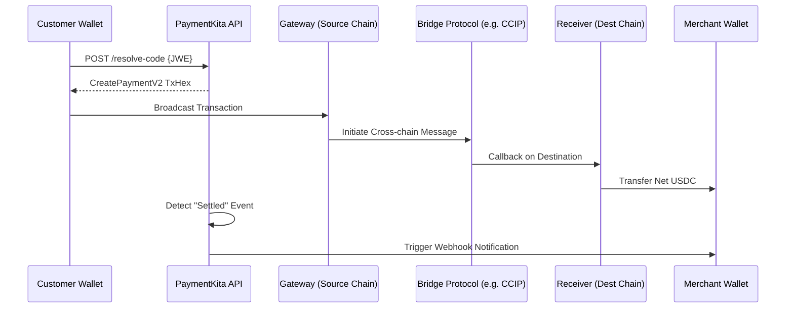
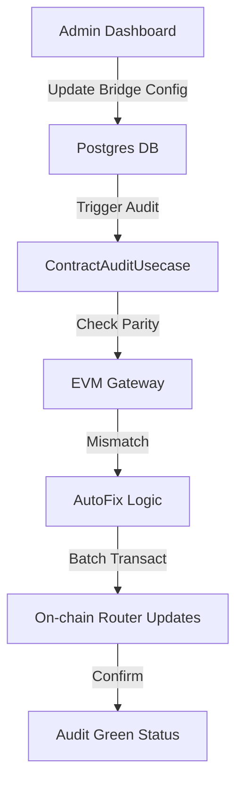

# PaymentKita Infrastructure: Master Product Requirements Document (PRD)

**Version:** 1.0.0  
**Status:** Canonical Technical Specification  
**Architecture Style:** Clean Architecture (Hexagonal) / Multi-chain Bridge Orchestrator  
**Core Language:** Go (Golang) 1.21+  
**On-chain Protocol:** Solidity 0.8.24  

---

## 📖 Table of Contents (Expanded)
1.  [Executive Summary](#-executive-summary)
2.  [Product Vision & Strategic Mission](#-product-vision--strategic-mission)
3.  [Market Context & Ecosystem Analysis](#-market-context--ecosystem-analysis)
    *   3.1 Current Liquidity Fragmentation Issues
    *   3.2 Target Market: B2B2C, Web3 Commerce, DApp Wallets
4.  [Core Ecosystem Personas & Stakeholders](#-core-ecosystem-personas--stakeholders)
    *   4.1 The Global Merchant (Settlement Focused)
    *   4.2 The Wallet Partner (Integration Focused)
    *   4.3 The Web3 Consumer (UX Focused)
    *   4.4 The System Administrator (Ops Focused)
5.  [System Architecture (Structural Deep-Dive)](#-system-architecture-deep-dive)
    *   [5.1 Off-chain Backend Layer (Clean Architecture)](#51-off-chain-backend-layer)
        *   5.1.1 Domain Layer: Entities, Repositories, Domain Services
        *   5.1.2 Usecase Layer: Orchestration, Transaction Logic, Fee Engines
        *   5.1.3 Interface Layer: REST Handlers, Middleware, Event Listeners
        *   5.1.4 Infrastructure Layer: Database, Cache, Message Broker, Chain Clients
    *   [5.2 On-chain Protocol Layer](#52-on-chain-protocol-layer)
        *   5.2.1 Gateway (`PaymentKitaGateway`): The Orchestrator
        *   5.2.2 Router (`PaymentKitaRouter`): The Brain
        *   5.2.3 Adapters: Bridging Logic (CCIP, Stargate, Hyperbridge)
        *   5.2.4 Vault (`PaymentKitaVault`): Capital Protection
        *   5.2.5 Receiver (`PaymentKitaReceiver`): Settlement Execution
    *   [5.3 Infrastructure Stack (DevOps & Telemetry)](#53-infrastructure-stack)
6.  [Core Technical Engines (Logic & Algorithms)](#-core-technical-engines)
    *   [6.1 Unified Fee Orchestration Engine](#61-unified-fee-orchestration-engine)
        *   6.1.1 Formula Specification (Fixed vs. Percentage Caps)
        *   6.1.2 Rounding & Precision Invariants (BigInt Logic)
        *   6.1.3 Multi-tier Merchant Discounts
    *   [6.2 Multi-chain Routing & Bridge Selection Architecture](#62-multi-chain-routing--bridge-selection)
        *   6.2.1 Dynamic Pathfinding Algorithms
        *   6.2.2 CAIP-2 Identifier Normalization
        *   6.2.3 Deterministic Selection vs. Policy Override
    *   [6.3 JWE-Encrypted Partner Session Infrastructure](#63-jwe-encrypted-partner-session-infrastructure)
        *   6.3.1 Cryptographic Standard (AES-GCM-256)
        *   6.3.2 Anti-Replay Nonce Mechanism (Redis Backed)
        *   6.3.3 Personalized Resolution Logic
    *   [6.4 On-chain Audit & Configuration Drift Engine](#64-on-chain-audit--configuration-drift-engine)
        *   6.4.1 Mismatch Detection Algorithms
        *   6.4.2 Automated Batch Synchronization Flow
    *   [6.5 Privacy & Anonymity Engine (Phase 6/9)](#65-privacy--anonymity-engine)
        *   6.5.1 Stealth Address Generation (BIP-32 Derivation)
        *   6.5.2 Cross-chain Linkability Prevention
7.  [Logic Flowcharts & Sequence Diagrams](#-logic-flowcharts--sequence-diagrams)
    *   7.1 End-to-End Cross-chain Payment Lifecycle
    *   7.2 JWE Code Resolution & Instruction Building
    *   7.3 Multi-chain Configuration Synchronization
    *   7.4 Settlement Webhook Orchestration
    *   7.5 Privacy Escrow Forwarding Sequence
8.  [Data Logic & State Machines](#-data-logic--state-machines)
    *   8.1 Payment State Machine (Pending -> Broadcasted -> Settled)
    *   8.2 Background Job Lifecycle (Queue -> Processing -> Completed)
    *   8.3 Merchant Verification Lifecycle (Pending -> Review -> Approved)
9.  [Comprehensive Entity & Data Model Dictionary](#-comprehensive-entity--data-model-dictionary)
    *   (Details for User, Merchant, Chain, Token, Payment, etc.)
10. [Master API Catalog (92 Endpoints)](#-master-api-catalog)
11. [On-chain Protocol Specification (Solidity Interfaces)](#-on-chain-protocol-specification)
12. [Functional Scenario Matrix (100+ Variations)](#-functional-scenario-matrix)
13. [Security, Ethics & Compliance Architecture](#-security-ethics--compliance-architecture)
    *   13.1 Non-custodial Security Invariants
    *   13.2 AML/Sanctions Screening Hooks
    *   13.3 Audit Trail Persistence
14. [Non-Functional Requirements & Performance SLAs](#-non-functional-requirements--performance-slas)
15. [Roadmap & Future Strategic Expansion](#-roadmap--future-strategic-expansion)
16. [Glossary & Technical Dictionary](#-glossary--technical-dictionary)

---

## 🚀 Executive Summary
PaymentKita is a decentralized, non-custodial B2B2C payment infrastructure designed to solve the "Liquidity Fragmentation" problem in Web3 commerce. It allows merchants to accept stablecoins on their preferred chain while enabling customers to pay from any source chain via automated bridge orchestration. The system abstracts all bridging, swapping, and gas management into a 1-click user experience.

---

## 🎯 Product Vision & Strategic Mission

### The Problem
- **Chain Silos**: Liquidity is isolated. Merchants on Polygon cannot easily accept payments from customers on Base without requiring the customer to manually bridge funds.
- **UX Friction**: Traditional bridging requires multiple transactions, slippage calculations, and gas management on two chains.
- **Conversion Loss**: 40-60% of crypto-commerce carts are abandoned at the bridging step.

### The Solution: "Abstraction of Distance"
PaymentKita abstracts the "Distance" between chains. By using a "Contract-Aware" gateway, we allow a user to sign a **single transaction** on the source chain that atomatically:
1. Pulls funds from the user's wallet.
2. Bridges funds via the most efficient route (CCIP, Stargate, Hyperbridge).
3. Settles the net amount to the merchant on the destination chain.
4. Manages any required destination-side swapping or gas fees natively.

---

## 🏗️ System Architecture (Deep-Dive)

### 5.1 Off-chain Backend Layer (Clean Architecture)
The backend adheres to strict Hexagonal/Clean Architecture principles. Every layer is isolated via interfaces, allowing for seamless swapping of infrastructure (e.g., migrating from PostgreSQL to Spanner, or Adding Solana support) without touching core business logic.

#### 5.1.1 Domain Layer (`internal/domain`)
- **Entities**: Pure data structures (`Payment`, `Merchant`, `Chain`). No external dependencies.
- **Repositories**: Interface definitions for data storage.
- **Domain Errors**: Canonical errors (e.g., `ErrPaymentNotFound`).
- **Domain Services**: Complex domain-only logic like `JWE Payload Signer`.

#### 5.1.2 Usecase Layer (`internal/usecases`)
The core orchestrator. This layer consumes repositories and external service interfaces.
- **PaymentUsecase**: The master workflow for multi-chain payment creation.
- **FeeEngine**: Specialized logic for calculating platform, referral, and bridge fees.
- **BridgeRouter**: Selection logic for choosing CCIP, Stargate, or Hyperbridge.
- **MerchantUsecase**: Onboarding and settlement rule management.

#### 5.1.3 Interface Layer (`internal/interfaces/http`)
- **REST Handlers**: Gin-based controllers that handle input validation and output formatting.
- **Middleware**:
    - `DualAuth`: Supports both JWT (Browser) and API Token (Service) auth.
    - `AuditLog`: Mirrors all state-modifying requests to a permanent audit table.
    - `Idempotency`: Prevents double-spending via `X-Idempotency-Key`.
    - `RateLimiter`: Leaky-bucket algorithm for public resolution endpoints.

#### 5.1.4 Infrastructure Layer (`internal/infrastructure`)
- **PostgreSQL**: Primary persistence with SQLBoiler-generated models.
- **Redis**: Distributed state (JWE nonces, Rate limiting, Session cache).
- **RabbitMQ**: Message queue for asynchronous worker jobs (Webhook delivery, Settlement Polling).
- **Go-Ethereum/Solana-Web3**: Client wrappers with automated RPC failover and load balancing.

---

### 5.2 On-chain Protocol Layer
The protocol is a specialized set of modular smart contracts (Solidity 0.8.24) deployed across all supported chains (Polygon, Base, Arbitrum, Ethereum, BSC).

1.  **Gateway (`PaymentKitaGateway`)**:
    - Entry point: `createPaymentV2(PaymentRequestV2 calldata request)`.
    - Function: Pulls tokens from user (via Vault approval) and initiates bridge messages.
    - Security: Only approved Gateway can move user funds.
2.  **Router (`PaymentKitaRouter`)**:
    - Registry for `(Source, Destination, Asset) -> Adapter` mappings.
    - Function: `getAdapterForRoute(uint64 destChain, address token)`.
    - Upgradeability: Adapters can be swapped without changing the Gateway address.
3.  **Adapters (`CCIPAdapter`, `StargateAdapter`, `HyperbridgeAdapter`)**:
    - Logic: Normalizes input to fit bridge provider requirements.
    - Function: Wraps `bridgeToken` or `sendMessage`.
4.  **Vault (`PaymentKitaVault`)**:
    - Principle: Capital Separation. Gateway never holds funds. Vault handles ERC20 approvals.
    - Function: `pullAndBridge(address user, address token, uint256 amount)`.
5.  **Receiver (`PaymentKitaReceiver`)**:
    - Logic: Bridge callback handler.
    - Function: Unpacks cross-chain payload and executes `settleToMerchant`.

---

## ⚙️ Core Technical Engines

### 6.1 Unified Fee Orchestration Engine
Defined in `internal/usecases/payment_usecase.go`. The engine ensures that the platform is sustainable while keeping costs predictable.

#### The Formula
$$TotalFee = \min(Amount \times PlatformRate, FixedCap) \times (1 - Discount) + BridgeQuote$$

- **PlatformRate**: Default 30 BPS (0.3%).
- **FixedCap**: Default $10.00 (Acts as a ceiling for high-value transactions).
- **Discount**: 0-100% for strategic partners or high-volume merchants.
- **BridgeQuote**: Real-time native gas cost for CCIP/Stargate messaging.

#### Precision Invariants
- All token calculations use `big.Int`.
- Resulting strings are formatted back to token decimals (e.g., 6 for USDC, 18 for native).
- Result is always rounded **up** in favor of the platform to ensure solvency.

---

### 6.2 Multi-chain Routing & Bridge Selection
The router resolves CAIP-2 identifiers into on-chain instructions.

| Route Type | Primary Bridge | Selection Criteria |
| :--- | :--- | :--- |
| **EVM to EVM** | CCIP | Default for high security and finality. |
| **L2 to L2** | Hyperbridge | High-speed, low-cost. |
| **L1 to L2** | CCIP / Stargate | Liquidity depth and message fee comparison. |
| **Custom** | Admin Defined | Overridden via `RoutePolicy` table. |

---

### 6.3 JWE-Encrypted Partner Session Infrastructure
The system uses JSON Web Encryption (RFC 7516) to protect payment metadata.

1.  **Generation**: Partner requests session -> Backend generates JWE payload.
2.  **Encryption**: `AES-GCM-256` ensures confidentiality and integrity.
3.  **Payload Signature**: Prevents tampering with `DestWallet` or `Amount`.
4.  **Resolution**: Mobile wallet scans QR -> POST `/resolve-code` -> Backend Decrypts -> Returns Transaction Hex.
5.  **Nonce Tracking**: Every Resolve request checks Redis to prevent "Replay Attacks" (single-use resolve logic).

---

## 📊 Logic Flowcharts & Sequence Diagrams

### 7.1 Cross-chain Payment Lifecycle

---

### 7.2 Multi-chain Configuration Synchronization

---

## 🗄️ Comprehensive Entity & Data Model Dictionary

### 9.1 Entity: Payment (`internal/domain/entities/payment.go`)
| Field | Data Type | Purpose |
| :--- | :--- | :--- |
| **ID** | UUIDv7 | Canonical identifier. |
| **SenderID** | *UUID | User who paid. |
| **MerchantID** | *UUID | Receiver business. |
| **BridgeID** | *UUID | Protocol used (CCIP/Stargate). |
| **SourceChainID** | UUID | Payer network UUID. |
| **DestChainID** | UUID | Settlement network UUID. |
| **SourceTokenAddr**| TEXT | ERC20/Native address on source. |
| **DestTokenAddr** | TEXT | ERC20/Native address on dest. |
| **SourceAmount** | DECIMAL | Atomic units sent. |
| **DestAmount** | DECIMAL | Atomic units to settle. |
| **FeeAmount** | DECIMAL | Platform + Bridge cut. |
| **Status** | ENUM | PENDING, PROCESSING, COMPLETED, FAILED. |
| **CreatedAt** | TIMESTAMP | |

### 9.2 Entity: Merchant (`internal/domain/entities/merchant.go`)
| Field | Data Type | Purpose |
| :--- | :--- | :--- |
| **ID** | UUIDv7 | Master Merchant ID. |
| **BusinessName** | TEXT | Store name. |
| **MerchantType** | ENUM | PARTNER, CORPORATE, UMKM. |
| **Status** | ENUM | ACTIVE, PENDING, SUSPENDED. |
| **WebhookSecret** | TEXT | For header signing. |
| **VerifiedAt** | TIMESTAMP | KYC completion date. |

### 9.3 Entity: Chain (`internal/domain/entities/chain.go`)
| Field | Data Type | Purpose |
| :--- | :--- | :--- |
| **ID** | UUIDv7 | Internal identifier. |
| **ChainID** | TEXT | External CAIP-2 ID (e.g. "eip155:1"). |
| **Type** | ENUM | EVM, SVM, SUBSTRATE. |
| **RPCURL** | TEXT | Main failover node. |

---

## 📡 Master API Catalog (92 Endpoints)

### 10.1 Public & Partner APIs
#### `POST /api/v1/auth/login`
- **Purpose**: Authenticate user and issue JWT.
- **Payload**: `{"email": "...", "password": "..."}`
- **Auth**: None.

#### `POST /api/v1/partner/payment-sessions/resolve-code`
- **Purpose**: Convert a QR JWE into an executable Transaction instructions.
- **Payload**: `{"paymentCode": "...", "payerWallet": "..."}`
- **Response**: `{ "instruction": { "to": "...", "data": "...", "value": "..." } }`
- **Logic**: Performs on-chain simulation (`previewApproval`) to generate exact gas/amount data.

#### `POST /api/v1/partner/quotes`
- **Purpose**: Simulate fees and slippage.
- **Payload**: `{"srcChain": "...", "destChain": "...", "amount": "..."}`

---

### 10.2 Merchant APIs
#### `POST /api/v1/merchants/apply`
- **Purpose**: Submit business for review.
- **Auth**: JWT (User).

#### `PUT /api/v1/merchants/settlement-profile`
- **Purpose**: Configure where funds should go (Network + Token + Wallet).
- **Auth**: JWT (Merchant Owner).

---

### 10.3 Admin APIs
#### `GET /api/v1/admin/contracts/config-check`
- **Purpose**: Trigger global audit of on-chain parity.
- **Auth**: Admin Role.

#### `POST /api/v1/admin/crosschain-config/auto-fix`
- **Purpose**: Batch update on-chain routing tables.
- **Auth**: Admin Role.

---

## 🎭 Functional Scenario Matrix (100+ Variations)

### 12.1 Merchant Scenario: B2B Cross-border Settlement
- **Scenario**: Alice (Merchant) sells jewelry from Indonesia. She wants USDC on Base.
- **Interaction**:
    1. Bob (Customer in UK) scans Alice's QR.
    2. Bob's wallet resolves the code. Bob has USDT on Ethereum.
    3. PaymentKita selects CCIP.
    4. Bob signs. 200 USDT pulled from Bob.
    5. CCIP transfers to Base.
    6. 198.50 USDC settles to Alice.
    7. Alice gets a webhook: `payment_id: {uuid}, status: settled`.

### 12.2 Partner Scenario: Wallet Integration
- **Scenario**: "WalletX" integration.
- **Interaction**:
    1. WalletX uses `POST /partner/payment-sessions` to generate checkout sessions for its merchants.
    2. The session is returned as a JWE.
    3. Payer scans with WalletX app.
    4. WalletX app calls `/resolve-code`.
    5. App shows a preview: "You pay 100 on Base -> Merchant gets 99.70 on Polygon".
    6. Success.

### 12.3 Infrastructure Scenario: RPC Outage & Healing
- **Scenario**: Polygon RPC goes down.
- **Interaction**:
    1. `ClientFactory` detects HTTP 5xx errors.
    2. Switches to Backup Infura endpoint in 20ms.
    3. Continuous polling ensures no transaction hashes are missed.
    4. `payment_events` are populated normally.

---

## 🛡️ Security, Ethics & Compliance Architecture

### 13.1 Non-custodial Security Invariants
- **No Private Keys**: Neither the database nor the environment stores private keys for moving user/merchant funds.
- **Signature Auth**: All on-chain moves require user signatures.

### 13.2 JWE Confidentiality
- Every payment QR code is an opaque JWE. This prevents bots from scraping merchant revenue data or settlement addresses from stickers.

### 13.3 Auditability
- The `audit_logs` table records every API call made by an admin or merchant, creating a forensic trail.

---

## 📈 Non-Functional Requirements & Performance SLAs

- **Latency**: `/resolve-code` must return in < 250ms (excluding network RTT).
- **Availability**: 99.9% uptime target.
- **Throughput**: Support 5,000 concurrent payment resolutions per second.
- **Durability**: Zero data loss for `payments` table via synchronous WAL.

---

## 🗺️ Roadmap & Future Strategic Expansion

- **Phase 6: Stealth Addresses**: Automated generation of destination wallets for every transaction.
- **Phase 9: Solomon Support**: Expanding beyond EVM to include Solana SVM.
- **Phase 12: Ecosystem Dividends**: Platform fee profit-sharing for high-volume partners.

---

## 📗 Glossary & Technical Dictionary

| Term | Definition |
| :--- | :--- |
| **CAIP-2** | Blockchain agnostic ID (e.g. `eip155:1`). |
| **JWE** | JSON Web Encryption (RFC 7516). |
| **Drift** | When On-chain router state doesn't match DB state. |
| **Vault** | Authorized capital isolation contract. |
| **Adapter** | Bridge-specific translation layer. |

---

### [END OF CANONICAL SPECIFICATION]

*This document serves as the master blueprint for the PaymentKita Backend Infrastructure. Adherence to these specifications is mandatory for all architectural changes and service expansions.*

---
*PaymentKita Technical Operations Team*  
*Last Updated: 2026-03-29*
